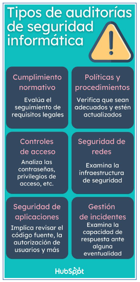

# Sesión #1 21/02/2024

- Dominios de Seguridad Cibernética
- Temario
  - 01 - Auditoria de seguridad (3 días)
    - Metodologías y técnicas de pentesting y pruebas de penetración.
    - Análisis de vulnerabilidades y de errores de configuración en los sistemas.
    - Técnicas y herramientas para la emulación automatizada de adversarios.
    - Análisis de resultados y propuesta de soluciones.
  - 02 - Ténicas forenses aplicadas a la respuesta a incidentes. (3 días)
    - El ciclo de vida de la respuesta a incidentes.
    - Adquisición de evidencias. Tipos y estrategias.
    - Análisis de elementos volátiles. Memoria RAM.
    - Análisis de elementos no volátiles. Artefactos del sistema de ficheros.
    - Herramientas de triaje. Adquisición rápida de evidencias.
    - Elaboración de la línea temporal del incidente.
  - 03 - Honeypots y sistemas de decepción (2 días)
    - Introducción a los sistemas de decepción y honeypots: objetivos, beneficios y usos.
    - Tipos de honeypots: baja, media y alta interacción. Integración en la infraestructura empresarial.
    - Diseño e implementación de honeypots: técnicas de configuración y monitorización.
    - Herramientas para la creación de honeypots.
    - Análisis de ataques y recolección de información.
    - ¿+? SIEM
  - 04 – Escenario práctico (2 días)
    - Intrusión en un sistema
    - Análisis del incidente
    - Lecciones aprendidas
- Fichero con listado de máquinas virtuales

---

01 - Auditoria de seguridad

## 01 - Auditoria de seguridad

### Introducción

Procedimiento que evalúa el nivel de seguridad de una empresa o entidad, analizando sus procesos y comprobando si sus políticas de seguridad se cumplen.

Detectar las vulnerabilidades y debilidades de seguridad que pueden ser utilizadas por terceros malintencionados para robar información, impedir el funcionamiento de sistemas, o en general, causar daños a la empresa.

Internas / Externas

### Fases de una auditoría de seguridad

- Planificación (alcance, objetivos, recursos, metodología)
- Recopilación de información (sin tocar nada si la empresa está bien documentada)
- Evaluación y análisis (a raíz de la información recopilada, en teoría sin tocar nada)
- Pruebas y verificación
  - Pentesting y pruebas de penetración. Verticales: hasta donde se puede llegar sin ser detectado o parado
  - Análisis de vulnerabilidades y de errores de configuración en los sistemas
  - Emulación de adversarios
  - Simulación de incidentes de seguridad (respuesta a incidentes)
- Informe y seguimiento

### Ejemplo

#### Planificación

- Establecimiento de objetivos específicos de la auditoría
- Definición de los sistemas y redes a auditar (scope o alcance)
- Identificación de los responsables y participantes
- Acuerdo sobre el enfoque y la metodología de la auditoría
- Establecimiento de un cronograma

#### Recopilación de información

- Políticas y procedimientos de seguridad existentes
- Listas de usuarios
- Registros de acceso
- Diagramas de red
- Configuraciones de sistemas y redes
- Otra información relevante

#### Evaluación y análisis

- Identificación de áreas de riesgo
- Detección de incumplimientos
- Identificación de oportunidades de mejora
- Priorización de hallazgos y recomendaciones

#### Pruebas y verificación

- Emulación de adversarios
- Pruebas de penetración
- Análisis de errores de bastionado y configuración
- Identificación de vulnerabilidades
- Simulación de incidentes de seguridad

#### Informe y seguimiento

- Elaboración del informe
- Presentación del informe
- Plan de acción
- Seguimiento y verificación

## Pentesting

(Hay un curso de pentesting específico)

### Fases de pentesting

- Planificación y preparación
- Recopilación de información
- Análisis de la información recopilada
- Explotación de vulnerabilidades y errores de configuración
- Post-explotación
- Informe y recomendaciones

### Tipos

- Pruebas de caja negra (sin información previa, lo más parecido a un atacante real externo)
- Pruebas de caja blanca (con información previa, lo más parecido a un atacante interno)
- Pruebas de caja gris (con información parcial)
- Pruebas internas (simular un atacante interno: empleado descontento, etc.)
- Pruebas externas
- Pruebas de aplicaciones web

### Metodologías

- [OSSTMM (Open Source Security Testing Methodology Manual)](https://www.isecom.org/OSSTMM.3.pdf)
- [PTES (Penetration Testing Execution Standard)](https://www.ciberseguridad.eus/ciberpedia/marcos-de-referencia/penetration-testing-execution-standard-ptes)
- [OWASP (Open Web Application Security Project)](https://owasp.org/)
- [NIST (National Institute of Standards and Technology)](https://nvlpubs.nist.gov/nistpubs/Legacy/SP/nistspecialpublication800-115.pdf)
- [TIBER-EU (Threat Intelligence-Based Ethical Red Teaming)](https://www.ecb.europa.eu/pub/pdf/other/ecb.tiber_eu_framework.en.pdf)

### Herramientas de pentesting

- Kali Linux (distribución de Linux con herramientas de seguridad)
- Metasploit (framework de explotación)
- Nmap (escaneo de puertos)
- Burp Suite (escaneo de aplicaciones web)
- Whiresark (sniffing)
- Nikto (escaneo de vulnerabilidades en servidores web)
- Sqlmap (SQL injection)
- John the Ripper (contraseñas)
- AirCrack-ng (ataques a redes inalámbricas)

Consultar [Hacktricks](https://book.hacktricks.xyz/welcome/readme) y [Awesome-pentest](https://github.com/enaqx/awesome-pentest)

## 02 - Análisis de vulnerabilidades y de errores de configuración

[El mito de la tecnología (Raúl Morales y Jesús Angosto, Ingenia)](https://www.youtube.com/watch?v=WyeYsJ_cfF4)

Video para ilustar la diferencia entre los errores de configuración y bastionado y las vulnerabilidades.

### Errores de configuración y bastionado

#### Guías y estándares de bastionado

- [Guías de CCN-STIC de Seguridad](https://www.ccn-cert.cni.es/guias.html)
- [Guías de CIS (Center for Internet Security)](https://www.cisecurity.org/cis-benchmarks/)
- [NIST SP 800-53](https://csrc.nist.gov/publications/detail/sp/800-53/rev-5/final)
- [DISA STIGs](https://public.cyber.mil/stigs/)
- [Microsoft Security Baselines](https://learn.microsoft.com/en-us/windows/security/operating-system-security/device-management/windows-security-configuration-framework/windows-security-baselines)
- [Center for Internet Security (CIS) Controls](https://www.cisecurity.org/controls/)

#### Herramientas de bastionado

- Purple Knight (bastionado de sistemas Windows)
- PingCastle (bastionado de sistemas Windows)
- Forest Druid (bastionado de sistemas Windows)
- Lynis (bastionado de sistemas Linux)

## 03 - Caso práctico. Purple Knight

> Máquina DC-01. Controlador de Dominio Windows Server 2019 + BadBlood
>
> Ejecutar como administrador
>
> Microsoft Azure AD se llama ahora Microsoft Entra ID
>
> [BadBlood](https://github.com/davidprowe/BadBlood) es un script que añade usuarios y unidades organizativas y configuraciones vulnerables. Es el hermano pequeño del proyecto [GOAD](https://github.com/Orange-Cyberdefense/GOAD)
>
> Recomendación de meter usuarios en el Grupo de Usuarios Protegidos (Protected Users), siempre que no haya problemas de compatibilidad.
>
> Los entornos OT suelen tener problemas de compatibilidad por el uso de protocolos antiguos.
>
> Los productos Microsoft por defecto guardan cierto equilibrio entre la compatibilidad y la seguridad, por lo que hay que revisar las configuraciones.
>
> Usuarios > marcar Características Avanzadas para ver usuarios de servicios
>
> Importante: cuando se actualice la contraseña de KERBEROS hay que cambiarla dos veces
>
> Comando gpupdate /force para forzar la actualización de las políticas de grupo
>
> [MITRE ATT&CK](https://attack.mitre.org/) es un marco de trabajo para la evaluación de la seguridad de los sistemas de información.
