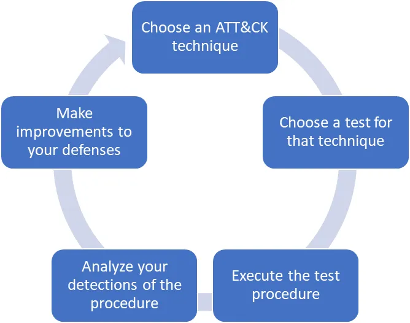
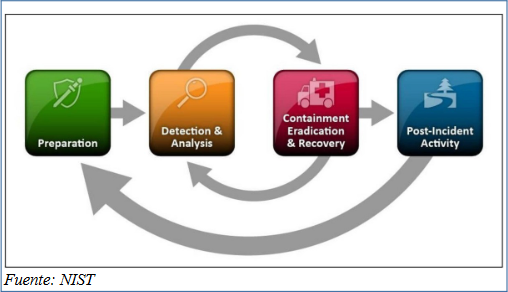

# Sesión #4 01/03/2024

## 10 - Monitorización de operaciones

Un proceso de emulación de adversarios resulta incompleto si no verificamos que nuestros sistemas de monitorización y/o detección (EDRs, SIEM, IDS, etc.) son capaces de identificar los ataques realizados.



Fuente [https://medium.com/mitre-attack/getting-started-with-attack-red-29f074ccf7e3](https://medium.com/mitre-attack/getting-started-with-attack-red-29f074ccf7e3)

- EDR y XDR son la evolución de los antivirus tradicionales. Herramientas de protección de endpoints.

- Los SIEM son sistemas de información y eventos de seguridad.

- Los IDS son sistemas de detección de intrusos.

- Los NGFW son firewalls de nueva generación.

## WAZUH

[Wazuh](https://wazuh.com/)

Wazuh es una plataforma de seguridad de código abierto que se utiliza para recopilar, analizar, monitorear y responder a eventos de seguridad, proporcionando visibilidad en tiempo real de lo que está sucediendo en los entornos de TI.

Aglutina las funcionalidades de EDR, SIEM e IDS.

Monitorización en tiempo real de eventos de seguridad.

- Análisis de seguridad.
- Detección de intrusiones
- Análisis de registros (logs).
- Evaluación de integridad de archivos.
- Detección de vulnerabilidades.
- Evaluación de configuración.
- Respuesta a incidentes.
- Cumplimiento de normativas.
- Seguridad en la Nube.
- Seguridad de contenedores.

Arrancar WAZUH
Login interfaz web con usuario admin/admin
Añadir agentes

``` bash
wget https://packages.wazuh.com/4.x/apt/pool/main/w/wazuh-agent/wazuh-agent_4.7.2-1_amd64.deb && sudo WAZUH_MANAGER='10.1.0.6' WAZUH_AGENT_NAME='Ubuntu' dpkg -i ./wazuh-agent_4.7.2-1_amd64.deb

(Arranque)
sudo systemctl daemon-reload
sudo systemctl enable wazuh-agent
sudo systemctl start wazuh-agent
```

``` psh
Invoke-WebRequest -Uri https://packages.wazuh.com/4.x/windows/wazuh-agent-4.7.2-1.msi -OutFile ${env.tmp}\wazuh-agent; msiexec.exe /i ${env.tmp}\wazuh-agent /q WAZUH_MANAGER='10.1.0.6' WAZUH_AGENT_NAME='Windows' WAZUH_REGISTRATION_SERVER='10.1.0.6'

(Arranque)
NET START WazuhSvc
```

Pruebas de operaciones sobre el linux para generar eventos

``` bash
(Arrancar CALDERA para generar eventos)
python3 server.py --insecure
```

Pruebas de operaciones sobre el Windows para generar eventos

``` psh
net user otro_usuario abc1234. /add
net localgroup administradores otro_usuario /add
```

Configuración para el monitor de integridad de archivos

``` bash
(/var/ossec/etc/ossec.conf)
<directories check_all="yes" report_changes="yes" realtime="yes">/root</directories>
```

``` psh
(C:\Program Files (x86)\ossec-agent\ossec.conf)
<directories check_all="yes" report_changes="yes" realtime="yes">C:\Users\<USER_NAME>\Desktop</directories>
```

Prueba de ataque de fuerza bruta con hydra contra el Escritorio Remoto (RDP) del Windows

``` bash
sudo apt install hydra
cat >> usuarios.txt
(Meter lista de usuarios, salir con CTRL+C)
cat >> contrasenas.txt
(Meter lista de contraseñas, salir con CTRL+C)
hydra -L usuarios.txt -P contrasenas.txt -vV 10.1.0.5 rdp
```

---

02 - Técnicas forenses en respuesta a incidentes

## 11 - Introducción

### Eventos de seguridad e incidentes de seguridad

Un **evento de seguridad** es cualquier cosa que **puede** tener una implicación en la seguridad de la organización, mientras que, un **incidente de seguridad** es aquel evento de seguridad que efectivamente **ha producido** un daño en la organización.

Toda organización debe tener un **Plan de respuesta a Incidentes**.

Ejemplo, un corte eléctrico es un evento de seguridad mitigado por un SAI, pero si el sistema cae, es un incidente de seguridad.

Otro ejemplo, un ataque de fuerza bruta a un formulario de una web es un evento de seguridad, pero si el ataque tiene éxito y consigue unas credenciales válidas, es un incidente de seguridad.

### Importancia

- Protección de datos y activos.
- Mitigación de riesgos.
- Cumplimiento normativo.
- Recuperación más rápida.
- Mejora de la postura de seguridad.
- Mantener la confianza de los clientes y socios.

### Ciclo de vida de la respuesta a incidentes

- [“Guía de seguridad para la Gestión de Incidentes” (NIST SP 800-61r2)](https://nvlpubs.nist.gov/nistpubs/specialpublications/nist.sp.800-61r2.pdf)
- [Agencia Europea de Seguridad de las Redes y de la Información (ENISA)](https://www.enisa.europa.eu/publications/good-practice-guide-for-incident-management)



#### Preparación

- Desarrollar “playbooks” de respuesta. Ejemplo [http://www.incidentresponse.org/playbooks/](http://www.incidentresponse.org/playbooks/).
- Asegurar los recursos necesarios que necesita el equipo de respuesta a incidentes.
- Definir, formar y evaluar el desempeño del equipo de respuesta a incidentes.

#### Detección y análisis

#### Contenimiento, erradicación y recuperación

#### Actividades post-incidente. Lecciones aprendidas
