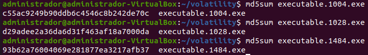

# Sesión #5 04/03/2024

> Plataformas de desafíos de seguridad
>
> - [ATENEA CCN-CERT.](https://atenea.ccn-cert.cni.es/)
> - [CTFtime](https://ctftime.org/)
> - [TryHackMe](https://tryhackme.com/)
>

## 11 - Introducción

### Planes de respuesta a incidencias (PRI)

El plan de respuesta a incidentes (PRI) es el documento corporativo que, considerando cada paso del ciclo de vida de respuesta a incidentes, establecerá y definirá procedimientos específicos para cada uno.

- Introducción y propósito: Explicar brevemente la importancia del plan, su alcance y objetivos, y cómo se relaciona con la estrategia general de seguridad de la información de la organización.
- Definiciones: Incluir definiciones claras de incidentes de seguridad, categorías y clasificaciones, así como cualquier otro término específico o jerga utilizada en el plan.
- Roles y responsabilidades: Detallar las responsabilidades del equipo de respuesta a incidentes, la dirección y otros empleados de la organización. Definir claramente los roles, como coordinador del equipo, analista de seguridad, especialista en comunicaciones, entre otros. [Ejemplo de roles y responsabilidades](https://www.atlassian.com/es/incident-management/incident-response/roles-responsibilities#tech-lead)
- Procedimientos de notificación y comunicación: Establecer protocolos para informar sobre incidentes de seguridad y comunicarse con las partes interesadas internas y externas, como empleados, proveedores, clientes y autoridades legales o regulatorias.
- Evaluación y clasificación de incidentes: Describir el proceso para determinar la gravedad y el impacto de un incidente, así como para establecer prioridades de respuesta.
- Contención, erradicación y recuperación: Definir los pasos y estrategias específicas para contener un incidente, eliminar la causa raíz y recuperar los sistemas y la funcionalidad afectados.
- Procedimientos de escalada: Establecer pautas para cuándo y cómo escalar incidentes a niveles superiores de gestión o involucrar a partes externas, como las fuerzas del orden o proveedores de servicios especializados.
- Documentación y seguimiento: Describir cómo se documentarán los incidentes y sus acciones de respuesta, incluidos los informes de incidentes y las lecciones aprendidas.
- Capacitación y concienciación: Detallar cómo se capacitará y concienciará al personal sobre la prevención, detección y respuesta a incidentes de seguridad de la información.
- Revisiones y actualizaciones periódicas: Establecer un proceso para revisar y actualizar regularmente el plan, asegurando que siga siendo relevante y efectivo a medida que cambian las amenazas, las vulnerabilidades y la organización en sí.
- Anexos y apéndices: Incluir cualquier documentación adicional relevante, como listas de contactos de emergencia, plantillas de informes de incidentes y otros recursos útiles para la respuesta a incidentes.

Referencias:

- [Incibe – Gestión de incidentes de seguridad](https://www.incibe.es/empresas/tematicas/gestion-incidentes-seguridad)
- [Incibe – Protege tu empresa – ¿Qué te interesa? – Plan de Contingencia y Continuidad de Negocio](https://www.incibe.es/protege-tu-empresa/que-te-interesa/plan-contingencia-continuidad-negocio)

## 12 - Adquisición de evidencias

> ¿Qué es? DFIR es el acrónimo en inglés de Digital Forensics Incident Response. Dentro de la informática forense existe la rama conocida como respuesta a incidentes (Incident Response) y la disciplina conocida como análisis forense digital (Digital Forensics).
>
> Siempre que el incidente lo permita, actuar con la cautela de no modificar las pruebas iniciales.

Uno de los retos principales a la hora de realizar un análisis forense es tener bien claro el tipo de incidente al que nos enfrentamos y a partir de él ver qué información es necesaria recopilar y la manera de proceder.

[RFC-3227](http://www.ietf.org/rfc/rfc3227.txt)

### Orden de volatilidad

Se debe recolectar en primer lugar aquella información que vaya a estar disponible durante el menor período de tiempo, es decir, aquella cuya volatilidad sea mayor.

> Configuración y conexiones de red, tabla ARP, usuarios logueados, procesos en ejecución,... > Memoria RAM > Discos duros > Pen Drives, CD’s, DVD's

### Acciones que deben evitarse

Con el fin de no invalidar el proceso de recolección de información

- No apagar el ordenador hasta que se haya recopilado toda la información volátil.
- No confiar en la información proporcionada por los programas del sistema.
- No ejecutar programas que modifiquen la fecha y hora de acceso de los ficheros del sistema.

### Herramientas de adquisición de evidencias

- Se deben utilizar herramientas ajenas al sistema.
- Se debe procurar utilizar herramientas que alteren lo menos posible el escenario.
- Los programas que se vayan a utilizar para recolectar las evidencias deben estar ubicados en un dispositivo de sólo lectura (CDROM, USB, etc.).
- Se debe preparar un conjunto de utilidades adecuadas a los sistemas operativos.
- El kit de análisis debe incluir, entre otros, los siguientes tipos de herramientas:
  - Programas para listar y examinar procesos.
  - Programas para examinar el estado del sistema.
  - Programas para realizar copias bit a bit.

### Consideraciones de privacidad

### Consideraciones previas

- No modificar el estado del equipo.
- Si está apagado, el hecho de encenderlo podría suponer la modificación de fechas o la ocultación de ficheros en el caso de que haya un rootkit.
- Establecer de manera global los pasos que se van a seguir.
- Concretar de manera detallada los pasos que se van a seguir.
- Prever y minimizar los riesgos.
- Valorar si la persona responsable de realizar el proceso tiene las habilidades y conocimientos necesarios para ello.
- Obtener una autorización por escrito para realizar el proceso.
- Solicitar las contraseñas necesarias para acceder al sistema y a ficheros o volúmenes cifrados.
- Tener preparado un kit lo más completo posible de utilidades.
- Preparar una lista de personas a las que se deba informar y mantener al tanto del proceso.

### Inicio del proceso

Se comienza etiquetando, inventariando y fotografiando todos los dispositivos que se van a analizar: discos duros, pendrives, cámaras, etc.
Se debe anotar la marca, modelo, número de serie, tipo de conexión (USB, firewire, etc.) de todos ellos.
Se deben tomar los datos de la persona responsable del equipo y del usuario o los usuarios que trabajen en él.
La cadena de custodia es fundamental.

### Adquisición en sistemas Windows

(Revisar video del profesor)

## 13 - Adquisición de elementos volátiles sobre Windows 10

### Consideraciones previas sobre la adquisición de elementos volátiles sobre Windows 10

El objetivo del caso práctico es probar la ejecución y el tipo de salida obtenida con algunos de los comandos y herramientas mencionados.

- La situación de partida es la de una máquina apagada que vamos a encender.
- Vamos a adquirir las evidencias en el mismo soporte donde tenemos las herramientas.
- Realmente al sacar conclusiones de los datos obtenidos estamos comenzando el proceso de análisis de evidencias.
- En la página principal de descarga de algunas herramientas de Nirsoft la versión descargada no permite el uso de parámetros para línea de comandos.
- Los motores antivirus pueden bloquear la ejecución de alguna de las herramientas mostradas, sobre todo aquellas relacionadas con la recuperación de contraseñas.

### Enunciado

Se sospecha que el usuario usuario estuvo realizando actividades anómalas dentro de la empresa. Utilizando los comandos y herramientas aprendidos, deberás de encontrar indicios que lo demuestren.

### Resolución

```bash
(Fichero .bat con los comandos a ejecutar)
@ECHO OFF
echo Comenzando adquisicion evidencias volatiles

echo date
date /t > FechaYHoraDeInicio.txt & time /t >> FechaYHoraDeInicio.txt

echo tasklist
tasklist > ProcesosEnEjecucion.txt

echo pslist
pslist64 /accepteula /t > ArbolDeProcesosEnEjecucion.txt

echo listdlls
listdlls64 /accepteula  > ProcesosYDlls.txt

echo handle
handle /accepteula /a > Handles.txt

echo cprocess
cprocess /stext ProcesosUsuario.txt

echo sc query
sc query > ServiciosEnEjecucion.txt

echo ipconfig
ipconfig /all > ConfiguracionRed.txt
ipconfig /displaydns > DNSCache.txt

echo arp
arp -a > ArpCache.txt

echo netstat
netstat -an | findstr /i "estado listening established" > PuertosAbiertos.txt
netstat -anob > AplicacionesConPuertosAbiertos.txt
netstat -r > TablaEnrutamiento.txt
nbtstat -S > ConexionesNetbiosEstablecidas.txt
nbtstat -S > ConexionesNetbiosEstablecidas.txt

echo net
net use > UnidadesMapeadas.txt
net share > CarpetasCompartidas.txt
net file > FicherosCopiadosMedianteNetbios.txt
net user > UsuariosDelEquipo.txt
net user nombre_usuario > InformacionUsuario_nombre_usuario.txt
net session > UsuariosRemotos.txt

echo psfile
psfile /accepteula > FicherosAbiertosRemotamente.txt

echo nbtstat
nbtstat -n > UsuariosYGruposNetbios.txt

echo logonsession
logonsessions /accepteula > SesionesActivas.txt

echo psloggedon
psloggedon /accepteula > UsuariosIniciadoSesion.txt

echo webbrowserpassview
WebBrowserPassView /SaveDirect /stext "ContraseñasNavegadores.txt"

echo netpass
Netpass /stext "NetworkPasswordRecovery.txt"

REM echo mailpv
REM mailpv /stext "MailPassView.txt"

echo Iecacheview
IECacheView /SaveDirect /stext "IECache.txt"

echo dir
dir /t:w /a /s /o:d c:\ > "ListadoFicherosPorFechaDeModificacion.txt"
dir /t:a /a /s /o:d c:\ > "ListadoFicherosPorUltimoAcceso.txt"
dir /t:c /a /s /o:d c:\ > "ListadoFicherosPorFechaDeCreacion.txt"

echo browsing historyview
BrowsingHistoryView.exe /VisitTimeFilterType 1 /HistorySource 1 /LoadIE 1 /LoadFirefox 1 /LoadChrome 1 /LoadSafari 1 /stab Historial.txt

echo mylast search
MyLastSearch /stext "MyLastSearch.txt"

echo doskey
doskey /history > HistoricoComandos.txt

echo openedfilesview
openedfilesview /stext > FicherosAbiertos.txt

echo net stats
net stats srv > ArranqueSistema.txt

echo screenshots
Screenshot-cmd -o "Screenshot.png"

echo cache navegadores
IECacheView /stab "IECache.txt"
Chromecacheview /stab "ChromeCacheView.txt"
MZCacheView /stab "FirefoxCacheView.txt"

echo eedh
call eedh.exe > "VolumenesEncriptados.txt"

echo Fecha y hora Fin
date /t > FechaYHoraFin.txt & time /t >> FechaYHoraFin.txt
echo Fin
```

Resultados

CarpetasCompartidas.txt

```cmd
Nombre       Recurso                         Descripci¢n

-------------------------------------------------------------------------------
C$           C:\                             Recurso predeterminado
IPC$                                         IPC remota
ADMIN$       C:\Windows                      Admin remota
compartidaparaMaldades
             C:\compartidaparaMaldades
Se ha completado el comando correctamente.
```

Usuarios del equipo.txt

```cmd
Cuentas de usuario de \\XW10-XX

-------------------------------------------------------------------------------
Administrador            DefaultAccount           Invitado
usuario                  UsuarioAlgoMalvado       UsuarioMalvado
WDAGUtilityAccount
Se ha completado el comando correctamente.

```

ListadoFicherosPorFechaDeModificacion.txt

```cmd
...
 Directorio de c:\Users\usuario\Documents

12/10/2020  18:48    <JUNCTION>     Mi m£sica [C:\Users\usuario\Music]
12/10/2020  18:48    <JUNCTION>     Mis v¡deos [C:\Users\usuario\Videos]
12/10/2020  18:48    <JUNCTION>     Mis im genes [C:\Users\usuario\Pictures]
12/10/2020  18:49               402 desktop.ini
13/06/2021  12:35               226 ComoEjecutarExploits.rtf
13/06/2021  12:36    <DIR>          ..
13/06/2021  12:36    <DIR>          .
13/06/2021  12:37                50 ComoHacerDoSaServidorEmpresa.txt
               3 archivos            678 bytes
...
```

MyLastSearch.txt

```cmd
==================================================
Search Text       : hydra
Search Engine     : Google
Search Type       : General
Search Time       : 13/06/2021 12:28:37
Web Browser       : Mozilla
Hits              : 1623583712
URL               : https%2Cgoogle.com%29,:https://www.google.com/search?client=firefox-b-d&q=hydra
==================================================

==================================================
Search Text       : hydra
Search Engine     : Google
Search Type       : General
Search Time       : 13/06/2021 12:28:37
Web Browser       : Mozilla
Hits              : 1623583717
URL               : https%2Cgoogle.com%29,:https://www.google.com/complete/search?q=hydra%20&cp=6&client=gws-wiz&xssi=t&gs_ri=gws-wiz&hl=es&authuser=0&pq=hydra&psi=4OvFYLH7JIGUlwSe4r3IBQ.1623583713646&dpr=1
==================================================

==================================================
Search Text       : hydra d
Search Engine     : Google
Search Type       : General
Search Time       : 13/06/2021 12:28:37
Web Browser       : Mozilla
Hits              : 1623583717
URL               : https%2Cgoogle.com%29,:https://www.google.com/complete/search?q=hydra%20d&cp=7&client=gws-wiz&xssi=t&gs_ri=gws-wiz&hl=es&authuser=0&pq=hydra&psi=4OvFYLH7JIGUlwSe4r3IBQ.1623583713646&dpr=1
==================================================

==================================================
Search Text       : hydra de
Search Engine     : Google
Search Type       : General
Search Time       : 13/06/2021 12:28:38
Web Browser       : Mozilla
Hits              : 1623583717
URL               : https%2Cgoogle.com%29,:https://www.google.com/complete/search?q=hydra%20de&cp=8&client=gws-wiz&xssi=t&gs_ri=gws-wiz&hl=es&authuser=0&pq=hydra&psi=4OvFYLH7JIGUlwSe4r3IBQ.1623583713646&dpr=1
==================================================

==================================================
Search Text       : hydra des
Search Engine     : Google
Search Type       : General
Search Time       : 13/06/2021 12:28:37
Web Browser       : Mozilla
Hits              : 1623583717
URL               : https%2Cgoogle.com%29,:https://www.google.com/complete/search?q=hydra%20des&cp=9&client=gws-wiz&xssi=t&gs_ri=gws-wiz&hl=es&authuser=0&pq=hydra&psi=4OvFYLH7JIGUlwSe4r3IBQ.1623583713646&dpr=1
==================================================

==================================================
Search Text       : hydra desc
Search Engine     : Google
Search Type       : General
Search Time       : 13/06/2021 12:28:38
Web Browser       : Mozilla
Hits              : 1623583717
URL               : https%2Cgoogle.com%29,:https://www.google.com/complete/search?q=hydra%20desc&cp=10&client=gws-wiz&xssi=t&gs_ri=gws-wiz&hl=es&authuser=0&pq=hydra&psi=4OvFYLH7JIGUlwSe4r3IBQ.1623583713646&gs_mss=hydra%20des&dpr=1
==================================================

==================================================
Search Text       : hydra desca
Search Engine     : Google
Search Type       : General
Search Time       : 13/06/2021 12:28:38
Web Browser       : Mozilla
Hits              : 1623583718
URL               : https%2Cgoogle.com%29,:https://www.google.com/complete/search?q=hydra%20desca&cp=11&client=gws-wiz&xssi=t&gs_ri=gws-wiz&hl=es&authuser=0&pq=hydra&psi=4OvFYLH7JIGUlwSe4r3IBQ.1623583713646&gs_mss=hydra%20des&dpr=1
==================================================

==================================================
Search Text       : hydra descar
Search Engine     : Google
Search Type       : General
Search Time       : 13/06/2021 12:28:38
Web Browser       : Mozilla
Hits              : 1623583718
URL               : https%2Cgoogle.com%29,:https://www.google.com/complete/search?q=hydra%20descar&cp=12&client=gws-wiz&xssi=t&gs_ri=gws-wiz&hl=es&authuser=0&pq=hydra&psi=4OvFYLH7JIGUlwSe4r3IBQ.1623583713646&gs_mss=hydra%20des&dpr=1
==================================================

==================================================
Search Text       : hydra descarg
Search Engine     : Google
Search Type       : General
Search Time       : 13/06/2021 12:28:38
Web Browser       : Mozilla
Hits              : 1623583718
URL               : https%2Cgoogle.com%29,:https://www.google.com/complete/search?q=hydra%20descarg&cp=13&client=gws-wiz&xssi=t&gs_ri=gws-wiz&hl=es&authuser=0&pq=hydra&psi=4OvFYLH7JIGUlwSe4r3IBQ.1623583713646&gs_mss=hydra%20des&dpr=1
==================================================

==================================================
Search Text       : hydra descarga
Search Engine     : Google
Search Type       : General
Search Time       : 13/06/2021 12:28:38
Web Browser       : Mozilla
Hits              : 1623583718
URL               : https%2Cgoogle.com%29,:https://www.google.com/complete/search?q=hydra%20descarga&cp=14&client=gws-wiz&xssi=t&gs_ri=gws-wiz&hl=es&authuser=0&pq=hydra&psi=4OvFYLH7JIGUlwSe4r3IBQ.1623583713646&gs_mss=hydra%20des&dpr=1
==================================================

==================================================
Search Text       : hydra descargar
Search Engine     : Google
Search Type       : General
Search Time       : 13/06/2021 12:28:39
Web Browser       : Mozilla
Hits              : 1623583718
URL               : https%2Cgoogle.com%29,:https://www.google.com/search?q=hydra+descargar&client=firefox-b-d&ei=4OvFYLH7JIGUlwSe4r3IBQ&oq=hydra+descargar&gs_lcp=Cgdnd3Mtd2l6EAMyAggAMgYIABAWEB4yBggAEBYQHjIGCAAQFhAeMgYIABAWEB4yBggAEBYQHjIGCAAQFhAeMgYIABAWEB4yBggAEBYQHjIGCAAQFhAeOgcIABBHELADOgcIABCwAxBDOgoILhCwAxDIAxBDOgUIABCxAzoICC4QsQMQgwE6CAguEMcBEK8BOgIILjoHCAAQsQMQQzoECC4QCjoECAAQCjoKCC4QxwEQrwEQCkoFCDgSATFQkBpYridg_ChoAXACeACAAZUCiAHwC5IBBTEuOS4xmAEAoAEBqgEHZ3dzLXdpesgBDMABAQ&sclient=gws-wiz&ved=0ahUKEwix68_TwJTxAhUByoUKHR5xD1kQ4dUDCA0&uact=5
==================================================

==================================================
Search Text       : instagram
Search Engine     : Google
Search Type       : General
Search Time       : 13/06/2021 12:31:30
Web Browser       : Mozilla
Hits              : 1623583889
URL               : https%2Cgoogle.com%29,:https://www.google.com/search?client=firefox-b-d&q=instagram
==================================================

==================================================
Search Text       : ophcrack
Search Engine     : Google
Search Type       : General
Search Time       : 13/06/2021 12:29:35
Web Browser       : Mozilla
Hits              : 1623583772
URL               : https%2Cgoogle.com%29,:https://www.google.com/search?client=firefox-b-d&q=ophcrack
==================================================

==================================================
Search Text       : programas de craking de contraseñas
Search Engine     : Google
Search Type       : General
Search Time       : 13/06/2021 12:27:55
Web Browser       : Mozilla
Hits              : 1623583659
URL               : https%2Cgoogle.com%29,:https://www.google.com/search?client=firefox-b-d&q=programas+de+craking+de+contrase%C3%B1as
==================================================

==================================================
Search Text       : t
Search Engine     : Google
Search Type       : General
Search Time       : 13/06/2021 12:32:11
Web Browser       : Chrome
Hits              : 0
URL               : _dk_https://google.com https://google.com https://www.google.com/complete/search?client=chrome-omni&gs_ri=chrome-ext-ansg&xssi=t&q=t&oit=1&cp=1&pgcl=7&gs_rn=42&psi=JfAimC-***************=AIzaSyBOti4mM-**********************
==================================================

==================================================
Search Text       : twi
Search Engine     : Google
Search Type       : General
Search Time       : 13/06/2021 12:32:11
Web Browser       : Chrome
Hits              : 0
URL               : _dk_https://google.com https://google.com https://www.google.com/complete/search?client=chrome-omni&gs_ri=chrome-ext-ansg&xssi=t&q=twi&oit=1&cp=3&pgcl=7&gs_rn=42&psi=JfAimC-***************=AIzaSyBOti4mM-**********************
==================================================

==================================================
Search Text       : twit
Search Engine     : Google
Search Type       : General
Search Time       : 13/06/2021 12:32:11
Web Browser       : Chrome
Hits              : 0
URL               : _dk_https://google.com https://google.com https://www.google.com/complete/search?client=chrome-omni&gs_ri=chrome-ext-ansg&xssi=t&q=twit&oit=1&cp=4&pgcl=7&gs_rn=42&psi=JfAimC-***************=AIzaSyBOti4mM-**********************
==================================================

==================================================
Search Text       : twitter
Search Engine     : Google
Search Type       : General
Search Time       : 13/06/2021 12:32:17
Web Browser       : Chrome
Hits              : 0
URL               : _dk_https://google.com https://google.com https://www.google.com/search?q=twitter&oq=twitter&aqs=chrome.0.0i131i433l2j0i433j0i3j0i131i433j46i433j0i131i433j0i433j0.1657j0j7&sourceid=chrome&ie=UTF-8
==================================================
```

ContraseñasNavegadores.txt

```cmd
==================================================
URL               : https://twitter.com/
Web Browser       : Internet Explorer 10.0
User Name         : hacker__desesperado@hotmail.com
Password          : contrasinalPot4nt3
Password Strength : Very Strong
User Name Field   :
Password Field    :
Created Time      :
Modified Time     : 13/06/2021 13:33:09
Filename          :
==================================================

==================================================
URL               : https://www.dropbox.com
Web Browser       : Firefox 32+
User Name         : hacker__desesperado@hotmail.com
Password          : C0ntras345&$nha
Password Strength : Very Strong
User Name Field   : login_email
Password Field    : login_password
Created Time      : 13/06/2021 13:31:20
Modified Time     : 13/06/2021 13:31:20
Filename          : C:\Users\usuario\AppData\Roaming\Mozilla\Firefox\Profiles\13487k28.default-release\logins.json
==================================================

==================================================
URL               : https://www.instagram.com
Web Browser       : Firefox 32+
User Name         : hacker__desesperado@hotmail.com
Password          : ve4s$·Ç"+234078afq23345
Password Strength : Very Strong
User Name Field   : username
Password Field    : password
Created Time      : 13/06/2021 13:31:49
Modified Time     : 13/06/2021 13:31:49
Filename          : C:\Users\usuario\AppData\Roaming\Mozilla\Firefox\Profiles\13487k28.default-release\logins.json
==================================================
```

Historial.txt

```cmd
...
http://www.oxid.it/ca_um/	oxid.it	13/06/2021 13:28:04	1	https://www.fullaprendizaje.com/2016/08/Las-10-mejores-herramientas-para-descifrar-contrasenas-en-Windows-Linux-y-aplicaciones-Web..html	Link	Firefox	usuario	13487k28.default-release	25		C:\Users\usuario\AppData\Roaming\Mozilla\Firefox\Profiles\13487k28.default-release\places.sqlite	6
https://accounts.binance.com/es/register?ref=KEJHR24A	Crear una cuenta gratis | Binance	13/06/2021 13:28:06	1	https://www.binance.com/es/register?ref=KEJHR24A	Temporary Redirect	Firefox	usuario	13487k28.default-release	53		C:\Users\usuario\AppData\Roaming\Mozilla\Firefox\Profiles\13487k28.default-release\places.sqlite	9
https://codeload.github.com/vanhauser-thc/thc-hydra/zip/refs/heads/master	thc-hydra-master.zip	13/06/2021 13:29:25	0		Download	Firefox	usuario	13487k28.default-release	73		C:\Users\usuario\AppData\Roaming\Mozilla\Firefox\Profiles\13487k28.default-release\places.sqlite	17
...
https://downloads.sourceforge.net/project/ophcrack/ophcrack/3.8.0/ophcrack-3.8.0-bin.zip?ts=gAAAAABgxewkOiZGCoJkF_vz3bc25ZJI9SYprgbXm0lcS7lVckSrsP7zyogOlbrSWtZFrmvrjL7KvCEzuToGHV9gMNCmpNqlCQ%3D%3D&use_mirror=jztkft&r=https%3A%2F%2Fophcrack.sourceforge.io%2F		13/06/2021 13:29:50	1	https://sourceforge.net/projects/ophcrack/files/ophcrack/3.8.0/ophcrack-3.8.0-bin.zip/download	Link	Firefox	usuario	13487k28.default-release	257		C:\Users\usuario\AppData\Roaming\Mozilla\Firefox\Profiles\13487k28.default-release\places.sqlite	22
...
```

> Esto prueba que el usuario ha accedido y descargado, pero no si se ha ejecutado. Para ello habría que buscar otras evidencias.

FirefoxCacheView.txt

```cmd
...
c1=2&c2=15547374&cs_ucfr=&gdpr=1&gdpr_p1t=0&gdpr_li=0&gdpr_purp.gif	image/gif; charset=utf-8	https://sb.scorecardresearch.com/b2?c1=2&c2=15547374&cs_ucfr=&gdpr=1&gdpr_p1t=0&gdpr_li=0&gdpr_purps=&gdpr_pcc=AA&cs_cmp_nc=0&cs_cmp_id=10&cs_cmp_sv=30&cs_cmp_rt=0&cs_it=b2&cv=3.8.0.210223&ns__t=1623583727421&ns_c=UTF-8&c7=https%3A%2F%2Fwww.redeszone.net%2F2019%2F06%2F08%2Fhydra-9-0-herramienta-romper-contrasenas%2F&c8=Hydra%209.0%3A%20herramienta%20para%20romper%20contrase%C3%B1as%20con%20fuerza%20bruta&c9=https%3A%2F%2Fwww.google.com%2F	64	1	13/06/2021 13:28:47	13/06/2021 13:28:47	N/A		HTTP/2 200 OK	13/06/2021 13:28:47	N/A		08DE40896B1DCE8AE41D23FE1887E0F4B6684471		No		W/"40-jHLN3x5dWpBzaQm4lkBmDWvrjrg"	442	https%2Credeszone.net%29
...
```

> Se pueden combinar el historial con la caché para revisar la navegación del usuario, porque a veces se borra uno y se deja el otro o viceversa.


```cmd
(Clonado de la mermoia RAM)
Comae-Toolkit-3.0.20200902.2\x64\DumpIt
```

Fichero XW10-XX-20240304-103611.dmp

Fichero XW10-XX-20240304-103611.json

```cmd
{
    "debugInfo": {
        "kdCopyDataBlock": -8791750715896,
        "kdDebuggerData": -8791743464672,
        "kdpDataBlockEncoded": -8791743137432,
        "ntosBase": -8791756050432,
        "pdbAge": 1,
        "pdbGuid": "81BC5C37-7C52-5081-645F-9958F209C527",
        "pdbName": "ntkrnlmp.pdb",
        "regCr0": 2147811377,
        "regCr3": 2064502784,
        "regCr4": 329464,
        "regNtCr3": 1744896
    },
    "fileInfo": {
        "fileSize": 2147020800,
        "sha256": "ed1203790f627260177531bb6c599fa3e3aa630605c8829cbf14eddf2cc83ee2"
    },
    "machineInfo": {
        "architectureType": "x64",
        "date": "2024-03-04T10:37:03.107Z",
        "machineId": "187E8DB8-91AF-4463-A4E3-B3A50FB97054",
        "machineName": "XW10-XX",
        "maxPhysicalMemory": 2147418112,
        "numberProcessors": 1,
        "timestamp": 133540221809523415,
        "userName": "usuario",
        "workgroupName": "WORKGROUP"
    },
    "osVersion": {
        "buildNumber": 19041,
        "majorVersion": 10,
        "minorVersion": 0,
        "productType": 1,
        "servicePackMajor": 0,
        "servicePackMinor": 0,
        "suiteMask": 256
    },
    "serviceInfo": {
        "acquisitionTime": "0:42",
        "ntStatus": 0,
        "serviceName": "DumpIt",
        "serviceVersion": "3.0.20200902.2",
        "totalAccessiblePages": 524173,
        "totalInaccessiblePages": 0,
        "totalPhysicalPages": 524173
    }
}
```

### Adquisición de elementos no volátiles

Si el equipo está encendido, no debe realizarse nunca un apagado ordenado del mismo, es decir, desconectaremos el equipo directamente del suministro eléctrico.

#### Clonado de disco

- Clonación por hardware.
- Clonación por software.

Tipos

- Clonación bit a bit.
- Imagen de disco.

Problema con los SSD

Los discos SSD continuamente seleccionan nuevos sectores de escritura, descartan sectores dañados o imprecisos y borran electrónicamente las celdas no utilizadas preparándolas para futuras operaciones de escritura.

En los casos en que se trabaje con discos de estado sólido, esa primera copia o clon será la evidencia sobre la que se tendrá que trabajar ya que es la que conservará siempre el mismo hash, lo cual no implica que se deba desatenderse del soporte físico original, el cual se debe conservar puesto que es la evidencia física original.

Marcar para escritura


Formatear


Formateado


Copiado


Resultado

```

```

## 15 - Análisis de la memoria física. Uso de volatility

### Análisis de la memoria RAM

El análisis de memoria RAM en el ámbito de la Informática Forense y la respuesta a incidentes (DIFR) es de gran importancia. La memoria RAM es un componente crucial en cualquier sistema, ya que almacena temporalmente los datos y procesos en ejecución. El análisis de esta memoria puede proporcionar información valiosa durante una investigación forense, permitiendo a los investigadores y profesionales de seguridad comprender y reconstruir los eventos ocurridos en un sistema. Algunas de las razones por las cuales el análisis de memoria RAM es importante en DIFR incluyen:

- Recuperación de datos volátiles.
- Identificación de procesos y conexiones maliciosas.
- Extracción de contraseñas y credenciales.
- Descubrimiento de evidencia de malware.
- Reconstrucción de la línea de tiempo del incidente.
- Identificación de artefactos ocultos.

### Volatility

Volatility es una herramienta forense de código abierto. Está escrita en Python y es compatible con Microsoft Windows, Mac OS X y Linux.

## 16 - Caso Practico. Instalación y uso de Volatility para análisis de memoria RAM

```bash
(Instalación)
sudo apt install git curl pip python-dev build-essential libssl-dev
git clone https://github.com/volatilityfoundation/volatility.git

curl https://bootstrap.pypa.io/pip/2.7/get-pip.py --output get-pip.py
python2 get-pip.py
python2 -m pip install pycrypto distorm3

cd volatility
python vol.py --info

(Instalación Versión 3)
sudo pip3 install yara-python
git clone https://github.com/volatilityfoundation/volatility3
cd volatility3/
python3 setup.py build
sudo python3 setup.py install
pip3 install -r requirements.txt
python3 vol.py -h
```

### Enunciado de Instalación y uso de Volatility para análisis de memoria RAM

### Resolución de Instalación y uso de Volatility para análisis de memoria RAM

```bash
md5sum caso1Volatility.dmp
8922965d14b8a0ef240b62d460e6146e  caso1Volatility.dmp
cat caso1Volatility.dmp.MD5.txt
8922965d14b8a0ef240b62d460e6146e
```


Se intenta identificar el sistema operativo

```bash
python vol.py -f caso1Volatility.dmp imageinfo
```


Como no devuelve resultado, se obtiene una lista com perfiles disponibles para Windows 7

```bash
python vol.py -f caso1Volatility.dmp --info | grep "Windows 7"
```


Se usa el perfil `Win7SP1x64`

Obtener el nombre del equipo

```bash
python vol.py -f caso1Volatility.dmp --profile=Win7SP1x64 printkey -K 'ControlSet001\Control\ComputerName\ComputerName'
```


Otra forma más sencilla es mediante las variables de entorno

```bash
python vol.py -f caso1Volatility.dmp --profile=Win7SP1x64 envars | grep -i computername
```


Revisión del historial de comandos para ver una conexión vía FTP

```bash
python vol.py -f caso1Volatility.dmp --profile=Win7SP1x64 cmdscan
```


Localizar por lo menos un proceso con malware

```bash
python vol.py -f caso1Volatility.dmp --profile=Win7SP1x64 pslist
```


Extraer los procesos de memoria, especificando su PID

```bash
python vol.py -f caso1Volatility.dmp --profile=Win7SP1x64 procdump -p 1004 -D .
Volatility Foundation Volatility Framework 2.6.1
Process(V)         ImageBase          Name                 Result
------------------ ------------------ -------------------- ------
0xfffffa8002f48b30 0x0000000000270000 AsustoMucho.ex       OK: executable.1004.exe
python vol.py -f caso1Volatility.dmp --profile=Win7SP1x64 procdump -p 1028 -D .
Volatility Foundation Volatility Framework 2.6.1
Process(V)         ImageBase          Name                 Result
------------------ ------------------ -------------------- ------
0xfffffa8002f3eb30 0x0000000000400000 haboer.exe           OK: executable.1028.exe
python vol.py -f caso1Volatility.dmp --profile=Win7SP1x64 procdump -p 1484 -D .
Volatility Foundation Volatility Framework 2.6.1
Process(V)         ImageBase          Name                 Result
------------------ ------------------ -------------------- ------
0xfffffa800297b060 0x00000000001b0000 7zFM.exe             OK: executable.1484.exe
```


Para comprobar si son maliciosos, se puede usar VirusTotal. Lo correcto siempre es calcular y subir su hash.

```bash
md5sum executable.1004.exe
c55ac9249b90ddb6c4546c8b242de70c  executable.1004.exe
md5sum executable.1028.exe
d29adee2a36da6d31f463af18a7000da  executable.1028.exe
md5sum executable.1484.exe
93b62a76004069e281877ea3217afb37  executable.1484.exe
```




Conexiones establecidas

```bash
python vol.py -f caso1Volatility.dmp --profile=Win7SP1x64 netscan
```
