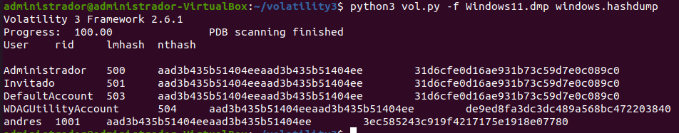
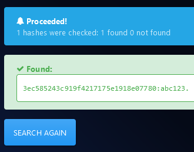

# Sesión #6 06/03/2024

## 16 - Caso Practico. Instalación y uso de Volatility para análisis de memoria RAM

Conexiones establecidas

```bash
python vol.py -f caso1Volatility.dmp --profile=Win7SP1x64 netscan
```

Filtrar aquellas que están establecidas

```bash
python vol.py -f caso1Volatility.dmp --profile=Win7SP1x64 netscan | grep ESTABLISHED
```


*Conexiones establecidas filtradas por aquellas ESTABLISHED*

Se pueden ver mucho navegador y un acceso FTP a 130.206.13.2:21 y comprobar su resolición lookup, por ejemplo [DomainTools](https://whois.domaintools.com)


*Comprobar a quien pertenece la IP 130.206.13.2*

Seguimos mirando, probamos con el proceso pytcw.exe que se conecta a varias IPs. Si comprobamos las IPs destino en [VirusTotal](https://www.virustotal.com), nos devuelve que alguna puede estar comprometida.

> [https://www.virustotal.com/gui/ip-address/104.207.226.108](https://www.virustotal.com/gui/ip-address/104.207.226.108)


*Se puede comprobar la IP 104.207.226.108 como comprometida*

Probamos con el hash del ejecutable, para comprobarlo en [VirusTotal](https://www.virustotal.com)

```bash
python vol.py -f caso1Volatility.dmp --profile=Win7SP1x64 pslist
```


*Localizar proceso sospechoso en la lista para obtener su PID*


*Volcar proceso sospechoso*


*Calcular su hash*


*Comprobar el hash en VirusTotal*

### Hay una contraseña de un archivo comprimido escrita dentro del Bloc de Notas. ¿Cuál es?

El plugin memdump nos permite extraer todas las páginas de memoria utilizadas por un proceso. Vamos a emplearlo para extraer las referentes al notepad.exe. De salidas anteriores sabemos que el proceso es el 2732.


*Localizar proceso notepad en la lista de procesos*

```bash
python vol.py -f caso1Volatility.dmp --profile=Win7SP1x64 memdump -p 2732 -D .
```


*Hacer un volcado de memoria del proceso notepad*

Vamos a emplear el comando "strings" de Linux (junto con "grep", otro comando fundamental para análisis forense) para buscar todas las cadenas de texto existentes en el volcado de memoria.

```bash
strings 2732.dmp | grep -B 2 -A 2 contras
SimpleProfile
Profile
highcontrast
Description
hbin
--
SimpleProfile
Profile
highcontrast
hbin
Description
--
FILE0
FILE0
C:\Users\wadmin\Desktop\contrase
as.txt
1SPS
--
DisplayName
Invalidaci
n de contrase
a habilitada
ratingSystemFileNames
--
FILE0
FILE0
la contrase
a del zip es abc123..
FILE0
```


*Buscar en el volcado por el termino "contras"*

### Existe un archivo zip accesible en la memoria RAM. ¿Qué animal se encuentra dentro?

En este caso vamos a utilizar el plugin "filescan" para que nos muestre un listado de archivos.

```bash
python vol.py -f caso1Volatility.dmp --profile=Win7SP1x64 filescan | grep zip

Volatility Foundation Volatility Framework 2.6.1
0x0000000043c1c9a0     13      0 R--r-d \Device\HarddiskVolume2\Program Files\7-Zip\7-zip.dll
0x0000000050223f20     16      0 R--r-d \Device\HarddiskVolume2\Windows\System32\es-ES\zipfldr.dll.mui
0x000000005675bdb0     16      0 R--r-d \Device\HarddiskVolume2\Windows\System32\zipfldr.dll
0x000000007eff3db0     16      0 R--r-d \Device\HarddiskVolume2\Windows\System32\zipfldr.dll
0x000000007f52e070      2      1 R--r-- \Device\HarddiskVolume2\Users\wadmin\Documents\fichero.zip
0x000000007fb7d9a0     13      0 R--r-d \Device\HarddiskVolume2\Program Files\7-Zip\7-zip.dll
0x000000007fb84f20     16      0 R--r-d \Device\HarddiskVolume2\Windows\System32\es-ES\zipfldr.dll.mui
```


*Buscar ficheros zip en la lista de ficheros*

```bash
python vol.py -f caso1Volatility.dmp --profile=Win7SP1x64 dumpfiles -Q 0x000000007f52e070 -D . -n

Volatility Foundation Volatility Framework 2.6.1
DataSectionObject 0x7f52e070   None   \Device\HarddiskVolume2\Users\wadmin\Documents\fichero.zip
SharedCacheMap 0x7f52e070   None   \Device\HarddiskVolume2\Users\wadmin\Documents\fichero.zip
```


*Volcar el fichero*

Y se comprueba el fichero zip extraído


*Comprobar el fichero extraído*

También se puede probar con el fichero de texto

```bash
python vol.py -f caso1Volatility.dmp --profile=Win7SP1x64 filescan | grep txt

Volatility Foundation Volatility Framework 2.6.1
0x00000000074d1070      1      1 -W-rw- \Device\HarddiskVolume2\Users\wadmin\AppData\Local\Temp\FXSAPIDebugLogFile.txt
0x0000000011d51070      3      0 -W-rwd \Device\HarddiskVolume2￭ﾄﾠￚﾧ￯ﾢﾠ￯﾿﾿￭ﾑﾠￛ﾿￯ﾢﾠ￯﾿﾿admin\AppData\Roaming\Microsoft\Windows\Cookies\wadmin@membero[1].txt
0x0000000032b94800      1      1 RW-rw- \Device\HarddiskVolume2￫ﾢﾠ￙ﾏ￯ﾢﾠ￯﾿﾿￥ﾩﾀ￘ﾼ￯ﾢﾠ￯﾿﾿admin\AppData\Roaming\Microsoft\Windows\Cookies\wadmin@membero[2].txt
0x000000004400bb50      2      0 -W-rwd \Device\HarddiskVolume2\Users\wadmin\AppData\Local\Microsoft\Windows\Temporary Internet Files\Low\Content.IE5\1S4P38MC\eb-c31c9a-a84bb8ba[1].txt
0x0000000045b6ba90      2      0 -W-rw- \Device\HarddiskVolume2\Users\wadmin\AppData\Roaming\Mozilla\Firefox\Profiles\4nrs364v.default\revocations.txt
0x000000004654c580     26      1 RW-rw- \Device\HarddiskVolume2￩ﾻﾰￜﾳ￯ﾢﾠ￯﾿﾿￥ﾻﾰ￙ﾔ￯ﾢﾠ￯﾿﾿admin\AppData\Roaming\Microsoft\Windows\Cookies\wadmin@membero[1].txt
0x000000005dea7f20      1      0 R--rw- \Device\HarddiskVolume2\Users\wadmin\AppData\Roaming\Mozilla\Firefox\Profiles\4NRS36~1.DEF\pkcs11.txt
0x00000000634f16d0      2      0 R--rw- \Device\HarddiskVolume2\Users\wadmin\AppData\Roaming\Mozilla\Firefox\Profiles\4nrs364v.default\SiteSecurityServiceState.txt
0x0000000069c82a10     16      0 -W---- \Device\HarddiskVolume2\Users\wadmin\AppData\Roaming\Microsoft\Windows\Cookies\wadmin@initilizeinstall[2].txt
0x000000007e6596d0     16      0 R--rw- \Device\HarddiskVolume2\Users\wadmin\AppData\Roaming\Mozilla\Firefox\Profiles\4nrs364v.default\SiteSecurityServiceState.txt
0x000000007e673b50      2      0 -W-rwd \Device\HarddiskVolume2\Users\wadmin\AppData\Local\Microsoft\Windows\Temporary Internet Files\Low\Content.IE5\1S4P38MC\eb-c31c9a-a84bb8ba[1].txt
0x000000007e6b9070      1      1 -W-rw- \Device\HarddiskVolume2\Users\wadmin\AppData\Local\Temp\FXSAPIDebugLogFile.txt
0x000000007e70ff20      1      0 R--rw- \Device\HarddiskVolume2\Users\wadmin\AppData\Roaming\Mozilla\Firefox\Profiles\4NRS36~1.DEF\pkcs11.txt
0x000000007ec20200      2      0 -W---- \Device\HarddiskVolume2\Users\wadmin\AppData\Roaming\Microsoft\Windows\Cookies\wadmin@membero[2].txt
0x000000007f9f4a10     16      0 -W---- \Device\HarddiskVolume2\Users\wadmin\AppData\Roaming\Microsoft\Windows\Cookies\wadmin@initilizeinstall[2].txt
0x000000007fa06070      2      0 RW-rw- \Device\HarddiskVolume2\Users\wadmin\Desktop\contraseￃﾱas.txt
0x000000007fa4f510      2      0 -W---- \Device\HarddiskVolume2\Users\wadmin\AppData\Roaming\Microsoft\Windows\Cookies\Low\wadmin@msn[2].txt
0x000000007fa8e9b0     16      0 RW-rw- \Device\HarddiskVolume2\Users\wadmin\AppData\Roaming\Mozilla\Firefox\Profiles\4nrs364v.default\Telemetry.FailedProfileLocks.txt
0x000000007fcc9a90      2      0 -W-rw- \Device\HarddiskVolume2\Users\wadmin\AppData\Roaming\Mozilla\Firefox\Profiles\4nrs364v.default\revocations.txt
0x000000007fce4640      2      0 -W---- \Device\HarddiskVolume2\Users\wadmin\AppData\Roaming\Microsoft\Windows\Cookies\wadmin@www.hugedomains[3].txt
0x000000007fd2f3a0      2      0 -W---- \Device\HarddiskVolume2\Users\wadmin\AppData\Roaming\Microsoft\Windows\Cookies\wadmin@hugedomains[2].txt
0x000000007fdcf590      2      0 -W-rwd \Device\HarddiskVolume2\Users\wadmin\AppData\Local\Microsoft\Windows\Temporary Internet Files\Low\Content.IE5\1S4P38MC\eb-c31c9a-a84bb8ba[2].txt
```

Se extrae el fichero de texto

```bash
python vol.py -f caso1Volatility.dmp --profile=Win7SP1x64 dumpfiles -Q 0x000000007fa06070 -D . -n

Volatility Foundation Volatility Framework 2.6.1
DataSectionObject 0x7fa06070   None   \Device\HarddiskVolume2\Users\wadmin\Desktop\contraseñas.txt
```


*Comprobar el fichero txt extraido*

### Volatility3 con Windows11

### En el equipo existe un usuario llamado Andrés. ¿Cuál es su contraseña de acceso al equipo?

```bash
python3 vol.py -f Windows11.dmp windows.hashdump

Volatility 3 Framework 2.6.1
Progress:  100.00        PDB scanning finished
User    rid    lmhash    nthash

Administrador    500    aad3b435b51404eeaad3b435b51404ee    31d6cfe0d16ae931b73c59d7e0c089c0
Invitado    501    aad3b435b51404eeaad3b435b51404ee    31d6cfe0d16ae931b73c59d7e0c089c0
DefaultAccount    503    aad3b435b51404eeaad3b435b51404ee    31d6cfe0d16ae931b73c59d7e0c089c0
WDAGUtilityAccount    504    aad3b435b51404eeaad3b435b51404ee    de9ed8fa3dc3dc489a568bc472203840
andres    1001    aad3b435b51404eeaad3b435b51404ee    3ec585243c919f4217175e1918e07780
```



*Hash de clave del usuario*

Comprobar listados de hashes NTLM [https://hashes.com/en/decrypt/hash](https://hashes.com/en/decrypt/hash) [https://md5decrypt.net/en/Ntlm/](https://md5decrypt.net/en/Ntlm/)



*Clave y hash de clave en listado público*

Calculadora de hashes NTLM [https://www.browserling.com/tools/ntlm-hash](https://www.browserling.com/tools/ntlm-hash) para comprobar si el hash de una contraseña ya está listada.

### En el escritorio del usuario existe un archivo de texto con las instrucciones para los trucos. ¿Cómo se llama el organizador principal y de qué barrio de Ferrol es su cómplice?

```bash
python3 vol.py -f Windows11.dmp windows.filescan > ficheros.txt
```


*Busqueda de ficheros txt*

```bash
python3 vol.py -f Windows11.dmp windows.dumpfiles.DumpFiles --virtaddr 0xad06c33a7da0

Volatility 3 Framework 2.6.1
Progress:  100.00        PDB scanning finished
Cache    FileObject    FileName    Result

DataSectionObject    0xad06c33a7da0    FasesDoAtaque.txt    Error dumping file
```


*Volcar el fichero de texto*


*Examinar el contenido del fichero de texto*

Vemos, por lo tanto, que el organizador es Andrés y su complice es del barrio de Caranza.

### En la primera de las instrucciones dicen de encontrarse en un punto específico de Ferrol que le especifica en un plano. Resulta que el usuario tenía el Paint abierto con el plano dibujado. Sabiendo esto, ¿podrías decir en qué punto de Ferrol van a encontrarse?

Probar el plugin del screenshot

### La última versión del plan de acción, que incluye el último paso a realizar, se encuentra en un archivo .zip cifrado en el Escritorio del usuario. No es posible encontrar la clave de descifrado en la memoria pero, aún así, ¿eres capaz de descifrar el contenido y saber cuál será el último de los pasos que piensan dar?

```bash
python3 vol.py -f Windows11.dmp windows.dumpfiles.DumpFiles --virtaddr 0xad06c33a5cd0
```


*Contenido del fichero extraido*

## 17 - Análisis de evidencias en disco. Sistema de ficheros

## 18 - Caso Practico. Sistema de ficheros

## 19 - Análisis de evidencias en disco. El Registro de Windows

## 20 - Caso Practico. El registro de windows
