# Sesión #7 08/03/2024

## 20 - Caso Practico. El registro de windows

### ¿Qué dirección MAC tenía asignada el equipo en el momento de la captura?

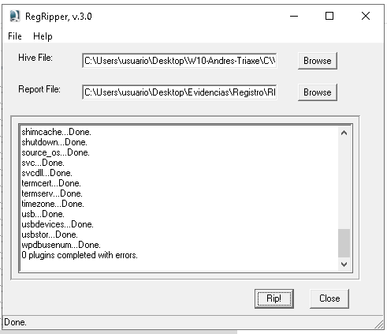

*RedRipper buscando en el fichero de registro SYSTEM*

Genera un fichero de texto donde buscar la información que se solicita.

```txt
----------------------------------------
networksetup2 v.20191004
(System) Get NetworkSetup2 subkey info

Ethernet - Intel(R) PRO/1000 MT Desktop Adapter (wired)
  CurrentAddress   : 8:0:27:79:2d:69
  PermanentAddress : 8:0:27:79:2d:69
----------------------------------------
nic2 v.20200525
(System) Gets NIC info from System hive

Adapter: {622563d8-0cba-11eb-8f19-806e6f6e6963}
LastWrite Time: 2021-06-19 11:36:09Z
```

> La dirección MAC del adaptador de red Ethernet era `8:0:27:79:2d:69`.

### ¿Qué zona horaria estaba utilizando?

```txt
----------------------------------------
timezone v.20200518
(System) Get TimeZoneInformation key contents

TimeZoneInformation key
ControlSet001\Control\TimeZoneInformation
LastWrite Time 2020-10-12 18:40:21Z
  DaylightName   -> @tzres.dll,-301
  StandardName   -> @tzres.dll,-302
  Bias           -> -60 (-1 hours)
  ActiveTimeBias -> -120 (-2 hours)
  TimeZoneKeyName-> Romance Standard Time
----------------------------------------
```

> Este equipo estaba en UTC+2, es decir, en la zona horaria de Europa Central.

### El usuario Andrés abrió recientemente un documento de texto. ¿Cuál era su nombre?

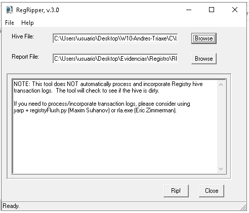

*RedRipper buscando en el fichero de registro NTUSER*

```txt
----------------------------------------
recentdocs v.20200427
(NTUSER.DAT) Gets contents of user's RecentDocs key

RecentDocs
**All values printed in MRUList\MRUListEx order.
Software\Microsoft\Windows\CurrentVersion\Explorer\RecentDocs
LastWrite Time: 2021-06-19 16:00:41Z
  6 = RecordatorioEnviarDocumento.txt
  5 = Internet
  4 = Redes e Internet
  3 = ::{8E908FC9-BECC-40F6-915B-F4CA0E70D03D}
  1 = Descargas
  2 = E0c3InFXsAI7Gfp.jfif
  0 = gato-blanco.jpg
```

> El usuario Andrés abrió recientemente un documento de texto llamado `RecordatorioEnviarDocumento.txt`.

### El usuario tenía una carpeta compartida. ¿Cuál era su ruta?

Vamos a usar el Registry Explorer, que permite a mayores cargar los hives y sus logs de transacciones.

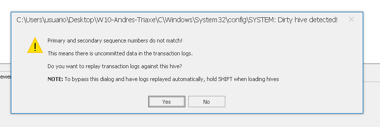

*Registry Explorer preguntando si queremos los logs del hive cargado*

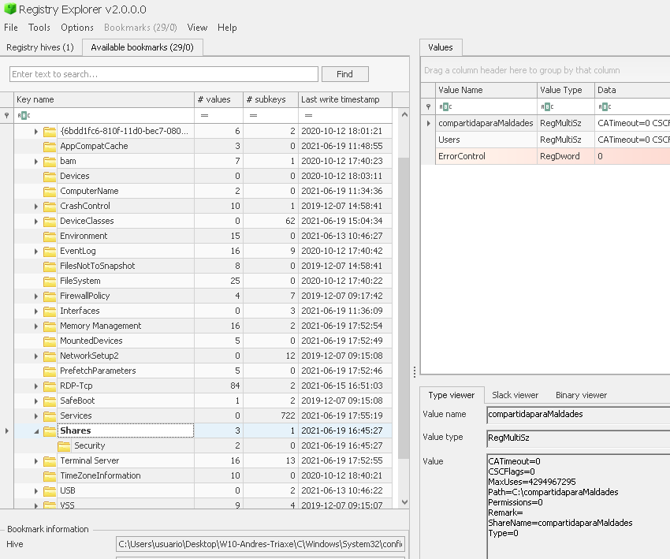

*Registry Explorer localizando la carpeta compartida*

> La carpeta compartida estaba en `C:\compartidaparaMaldades`.

## 24 - Herramientas de triaje y análisis automatizado de evidencias

En muchas ocasiones, especialmente en el caso de respuesta a incidentes, el análisis rápido de la situación puede marcar la diferencia entre un pequeño incidente y un bloqueo total de nuestros sistemas.

### Elementos o artefactos a adquirir

- Captura de la memoria RAM
- Ficheros de memoria virtual
- Registro de Windows
- Archivos Prefetch
- MFT
- Papelera de reciclaje
- Navegación web: historial de navegación, caché,…
- Eventos
- Información de usuarios

### Adquisición local de evidencias

#### Herramientas de triaje

- [BrimorLabs Live Response Collection](https://www.brimorlabs.com/tools/)
- [IR Triage Toolkit](https://github.com/AJMartel/IRTriage)
- [CyLR](https://github.com/orlikoski/CyLR/releases)
- [Kape](https://www.kroll.com/en/services/cyber-risk/incident-response-litigation-support/kroll-artifact-parser-extractor-kape)

#### Pruebas con Kape

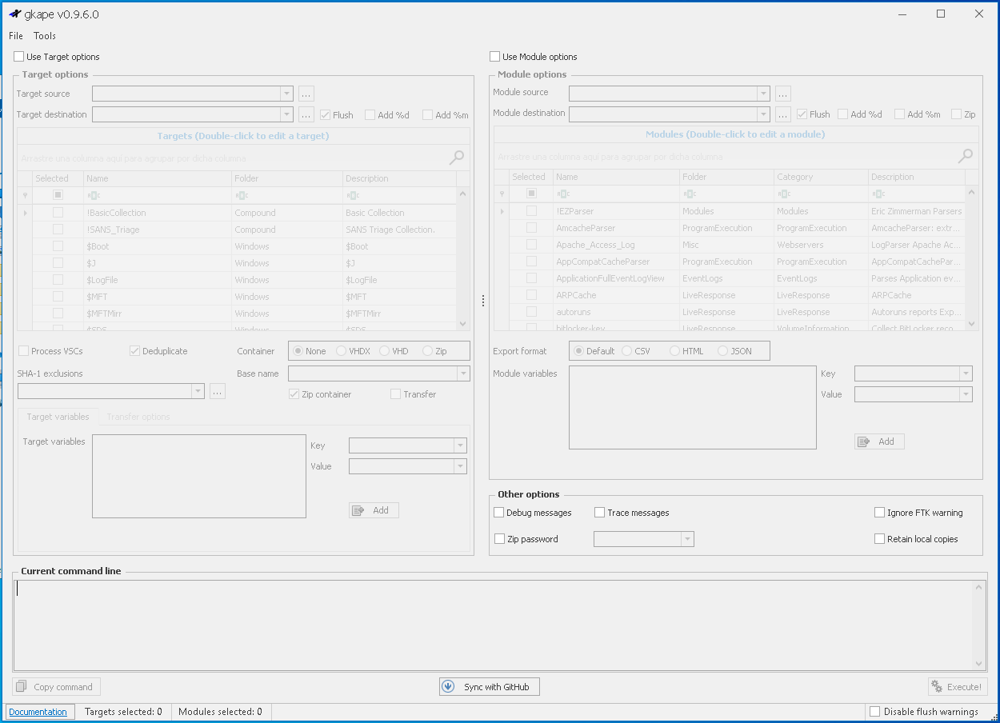

*Arrancando Kape*

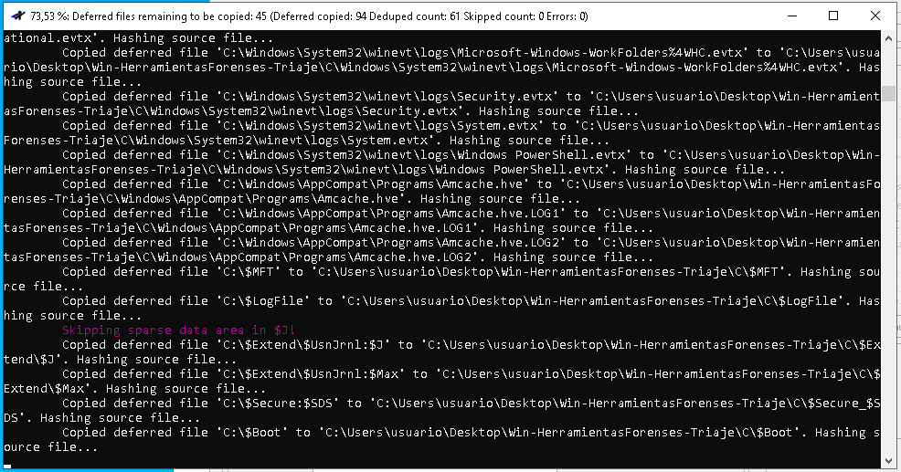

*Ejecutando Kape*

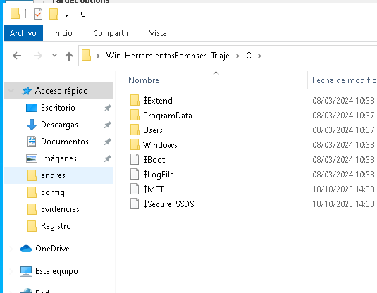

*Resultado de la ejecución de Kape*

### Adquisición remota de evidencias

#### Velociraptor

Una de las herramientas para la adquisición remota de evidencias que más ha crecido en uso en los últimos años es, sin lugar a dudas, Velociraptor.

[Velociraptor](https://www.velocidex.com/)

### Análisis automatizado de evidencias

Existen varias herramientas en el mercado que nos permiten realizar un análisis automatizado de las evidencias adquiridas.

- [EnCase Forensic Software](https://www.guidancesoftware.com/encase-forensic).
- [Oxygen Forensic Detective](https://www.oxygen-forensic.com/en/).
- [Autopsy/The Sleuth Kit](https://www.sleuthkit.org/).
- [E3:Universal (Paraben Suite)](https://www.paraben.com/e3-universal/).

## 21 - Análisis de evidencias en disco. El log de eventos

Los registros de eventos de Windows (Windows Event Logs) son archivos en formato binario (con la extensión .evtx) almacenados localmente en un directorio del sistema de archivos del equipo:

- Windows 2000 a WinXP / Windows Server 2003 : %WinDir%\system32\Config*.evt
- Windows Server 2008 a 2019 y Windows Vista a Win10 : %WinDir%\system32\WinEVT\Logs*.evtx

Categorías de eventos:

- Aplicación: eventos registrados por una aplicación (ejecución, error de implementación, etc.)
- Sistema: eventos registrados por el sistema operativo (carga del dispositivo, errores de inicio, etc.)
- Seguridad: eventos que son relevantes para la seguridad del sistema (inicios y cierres de sesión, eliminación de archivos, concesión de permisos de administración, etc.)
- Servicio de directorio: este es un registro disponible solo para controladores de dominio, almacena eventos de Active Directory (AD).
- Servidor DNS: es un registro disponible solo para servidores DNS; se almacenan registros del servicio DNS.
- Servicio de replicación de archivos: es un registro disponible solo para controladores de dominio, almacena eventos de replicación de controladores de dominio.

Listado de eventos:

[https://www.ultimatewindowssecurity.com/securitylog/encyclopedia/](https://www.ultimatewindowssecurity.com/securitylog/encyclopedia/)

### El Visor de eventos (Event Viewer)

Los eventos de Windows son recolectados y almacenados por el Servicio de Registro de Eventos y pueden ser visualizados mediante el Visor de Eventos de Windows o mediante herramientas externas. como [LogParser](https://www.microsoft.com/en-us/download/details.aspx?id=24659) o [FullEventLogView](https://www.nirsoft.net/utils/full_event_log_view.html).

### Probando el DeepBlueCLI

Hay que cambiar la Política de Ejecución aplicada a nuestro usuario.

```powershell
PS Set-ExecutionPolicy Bypass -Scope CurrentUser
```

Se ejecuta contra los ficheros de triaje (si no se especifica un fichero, se ejecuta contra los ficheros de eventos del sistema).

```powershell
PS C:\Users\usuario\Desktop\Herramientas Forenses\EvenLog\DeepBlueCLI> .\DeepBlue.ps1 C:\Users\usuario\Desktop\W10-Andres-Triaxe\C\Windows\System32\winevt\logs\Security.evtx
```

Resultado

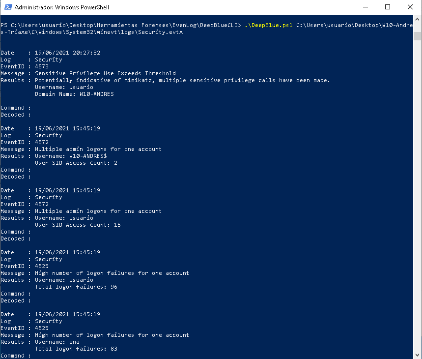

*Resultado de la ejecución de DeepBlueCLI*

Detecta la posible ejecución de Mimikatz y múltiples intentos de login fallidos (fuerza bruta).

## 22 - Análisis de evidencias en disco. Otros artefactos de Windows

### Archivos Prefetch

Son pequeños archivos con extensión .pf que facilitan que el inicio del sistema se realice más rápido, ya que por cada programa ejecutado se crea un archivo Prefetch que contiene información sobre el mencionado programa, como es su ruta, la fecha y hora de modificación, creación y última vez que se ejecutó, entre otros datos.

### SuperFetch

SuperFetch es un servicio de Windows que analiza el uso de la memoria y los programas que se ejecutan con más frecuencia, para que el sistema pueda cargarlos más rápido.

### Historial de actividad de Windows (Timeline)

El Historial de actividad de Windows (Timeline) es una característica de Windows 10 que permite a los usuarios ver y reanudar actividades pasadas en sus dispositivos.

### Registro de seguimiento (Event Trace Log)

El registro de seguimiento (Event Trace Log) es un mecanismo de Windows que permite a los desarrolladores de software registrar eventos en un sistema en tiempo real.

No son archivos que se suelen tener muy en cuenta a la hora de la extracción de evidencias forenses, pero de ellos se puede extraer un dato que puede ser muy valioso, que son las direcciones IP públicas que tuvo asociadas la máquina.

### Navegadores web

- Historial de navegación
- Caché web

## 23 - Caso Practico. Log de eventos y Otros artefactos de Windows

### Sospechamos que en la máquina se ejecutaron algunas herramientas de cracking de contraseñas, trata de averiguar cuáles fueron, a qué hora y con qué usuario

Se va a emplear la herramienta de WinPrefetchView para analizar los archivos Prefetch. Por defecto abre al Prefetch de la máquina local.

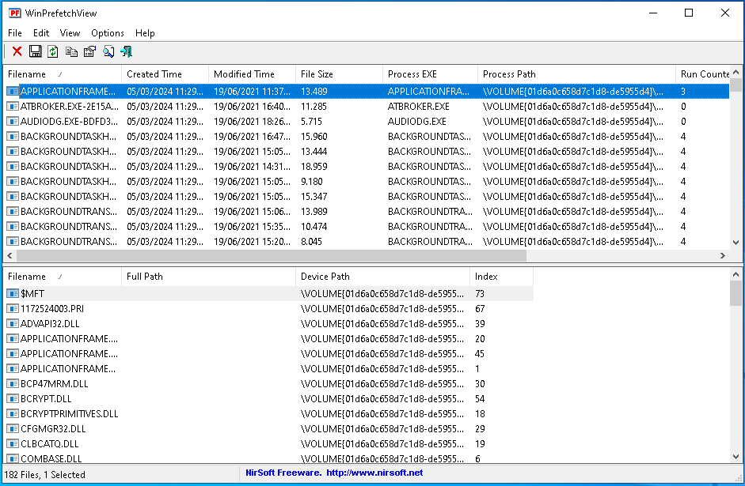

*Usando el WinPrefetchView con el Prefetch de los archivos de triaje*


*Localizando la última ejecución del Mimikatz*

Se ejecutó en la carpeta Donwloads, con el usuario Ana, con fecha 19/06/2021 15:49:12.

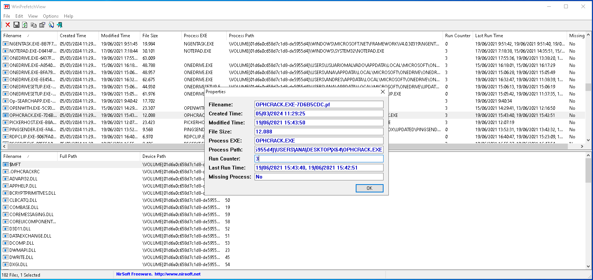

*Localizando la última ejecución del Ophcrack*

También en la carpeta Desktop del usuario Ana, 15:42:51 y 15:43:40.

### Antes de dicha ejecución, ¿hubo algún intento de fuerza bruta sobre el servicio RDP-Escritorio Remoto?

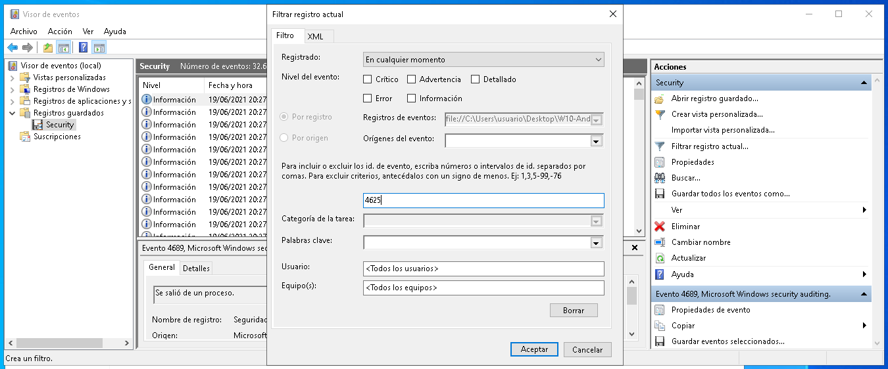

*Buscando en el log de eventos, del fichero guardado SECURITY, eventos con ID 4625*

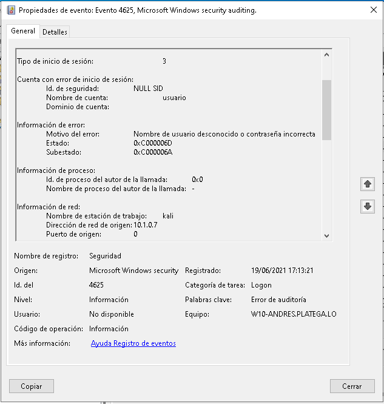

*Encontrando muchos inicios de sesión fallido juntos*

Al usuario `usuario` desde un equipo llamdo `kali` con IP `10.1.0.7`. El tipo de inicio de sesión es 3 (por red).

Si se sigue buscando, se encuentra otro intento contra el usuario `ana`.

### ¿Tuvieron éxito los ataques?

La forma más fácil es añadir al filtrado el 4624, que es el evento de inicio de sesión exitoso, y ver si en el tramo final de los intentos fallidos hay alguno exitoso.

Parece que encontramos dos secuencias de este tipo. Una entre las 14:38:30 y las 14:38:41 UTC y que fue realizado sobre el usuario Ana desde el equipo 10.1.0.7.

### ¿Desde qué IPs/Equipos de la red se hicieron conexiones a la máquina?

### A la vista de los resultados anteriores, ¿podemos garantizar que fue la usuaria Ana quien ejecutó las herramientas de cracking?

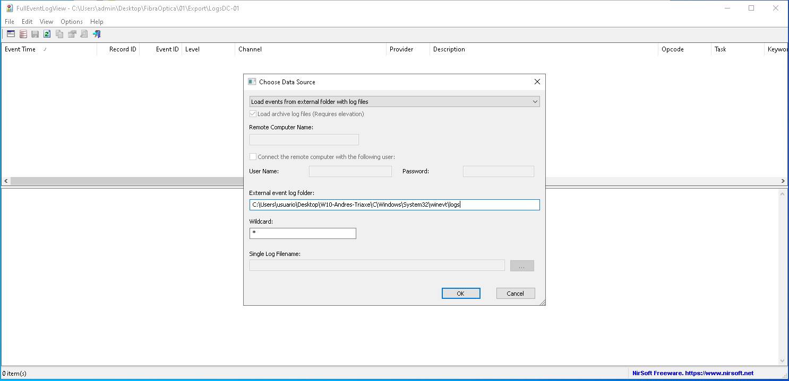

*Uso del FullEventLogViewcon los ficheros de eventos del triaje*


*Usando el WindowsTimeline parser para obtener evidencias de la ejecución de archivos maliciosos*

### ¿Cómo es posible que no saltara el Windows Defender e impidiera la ejecución de las herramientas de cracking?

Empezar buscando eventos 5001 y 5025

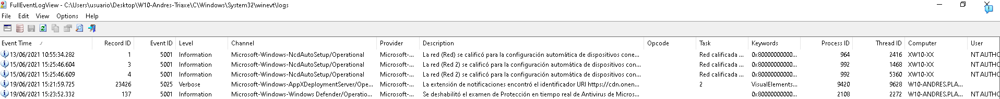

*Resultados de la búsqueda de eventos 5001 y 5025*

### ¿Cuándo y cómo llegaron las herramientas de cracking al equipo Win10-Andres?

Se usa el NTFS Log Parser para buscar la creación de los ficheros.


*Aparición del mimikatz*

Descarga primero.


*Aparición del ophcrack*

Situación típica de la ejecución de directa.

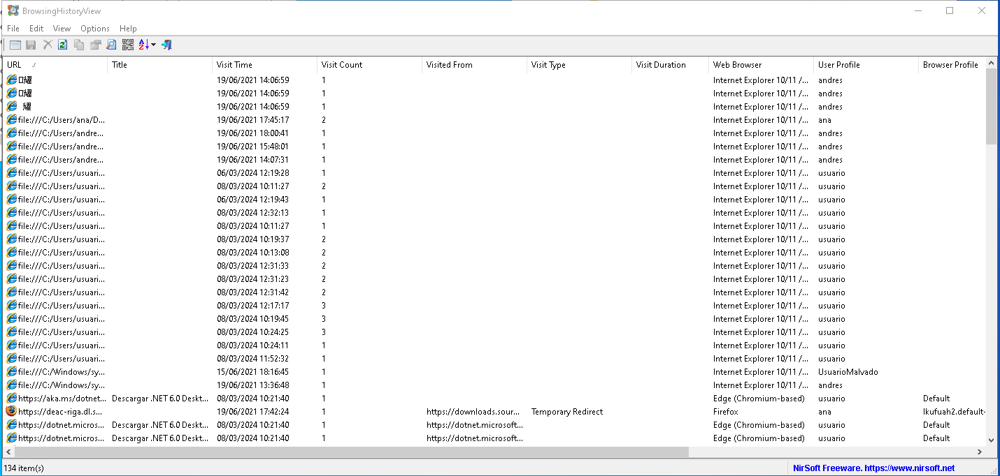

*Revisar información del historial de navegación con el BrowsingHistoryView*

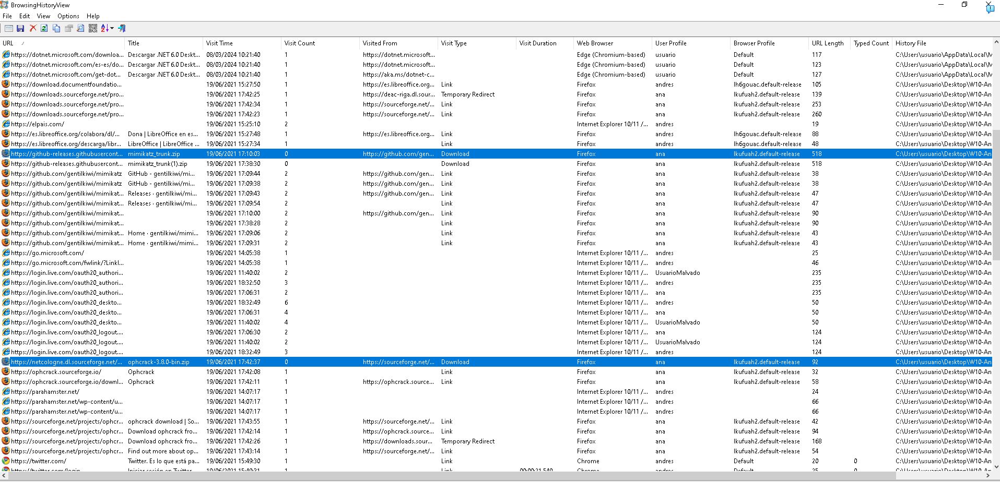

*Resaltado de evidencia de la descarga de mimikatz y ophcrack*

### ¿Existe alguna persistencia en el equipo o hubo algún intento de hacerla?

Se busca en el registro de Windows en el fichero SOFTWARE.

```txt
----------------------------------------
run v.20200511
(Software, NTUSER.DAT) [Autostart] Get autostart key contents from Software hive

Microsoft\Windows\CurrentVersion\Run
LastWrite Time 2021-06-19 17:53:08Z
  VBoxTray - %SystemRoot%\system32\VBoxTray.exe
  SecurityHealth - %windir%\system32\SecurityHealthSystray.exe

Microsoft\Windows\CurrentVersion\Run has no subkeys.

Microsoft\Windows\CurrentVersion\RunOnce
LastWrite Time 2019-12-07 09:17:27Z
Microsoft\Windows\CurrentVersion\RunOnce has no values.
Microsoft\Windows\CurrentVersion\RunOnce has no subkeys.

Microsoft\Windows\CurrentVersion\RunServices not found.

Wow6432Node\Microsoft\Windows\CurrentVersion\Run
LastWrite Time 2019-12-07 09:17:27Z
Wow6432Node\Microsoft\Windows\CurrentVersion\Run has no values.
Wow6432Node\Microsoft\Windows\CurrentVersion\Run has no subkeys.

Wow6432Node\Microsoft\Windows\CurrentVersion\RunOnce
LastWrite Time 2019-12-07 09:17:27Z
Wow6432Node\Microsoft\Windows\CurrentVersion\RunOnce has no values.
Wow6432Node\Microsoft\Windows\CurrentVersion\RunOnce has no subkeys.

Microsoft\Windows\CurrentVersion\Policies\Explorer\Run not found.

Wow6432Node\Microsoft\Windows\CurrentVersion\Policies\Explorer\Run not found.

Microsoft\Windows NT\CurrentVersion\Terminal Server\Install\Software\Microsoft\Windows\CurrentVersion\Run not found.

Microsoft\Windows NT\CurrentVersion\Terminal Server\Install\Software\Microsoft\Windows\CurrentVersion\RunOnce not found.

Microsoft\Windows\CurrentVersion\StartupApproved\Run not found.

Microsoft\Windows\CurrentVersion\StartupApproved\Run32 not found.

Microsoft\Windows\CurrentVersion\StartupApproved\StartupFolder not found.

----------------------------------------
```

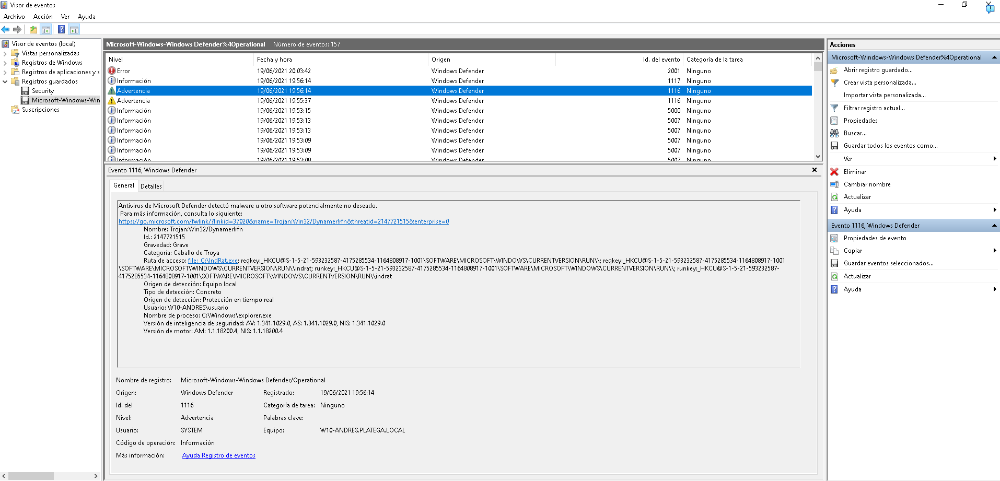

*Detección de un malware en el visor de eventos del Windows Defender*
